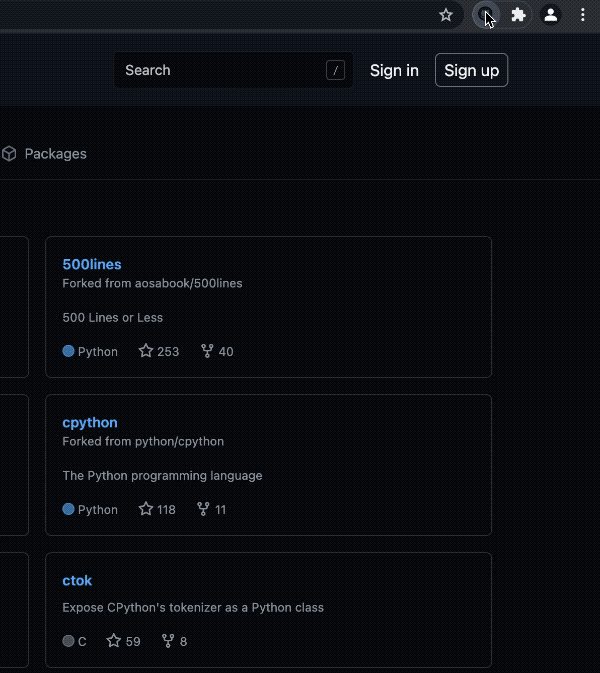

# gh-profiler

> A Github developer profiling tool



## Getting Started

Run the following commands to install dependencies and start developing

```
npm install
npm run dev
```

## Build

Run the following command to build the production-ready unpacked extension

```
npm run build
```

## Built with

- [React](https://reactjs.org)
- [TypeScript](https://www.typescriptlang.org/)
- [ESLint](https://eslint.org/)
- [Prettier](https://prettier.io/)
- [Webpack](https://webpack.js.org/)
- [webextension-polyfill-ts](https://github.com/Lusito/webextension-polyfill-ts)
